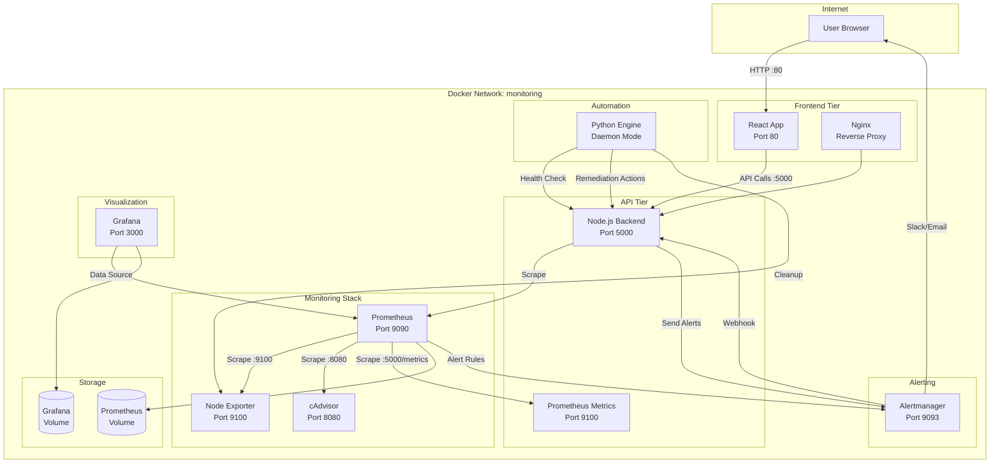

# Architecture Diagram

A text-based architecture diagram. For a production setup, generate an actual image 
using tools like Draw.io, Excalidraw, or Mermaid CLI.

## System Architecture

## Data Flow

1. **Metrics Collection**
   - Node Exporter collects OS-level metrics (CPU, memory, disk, network)
   - cAdvisor collects container-level metrics
   - Backend exposes custom application metrics
   - Prometheus scrapes all targets at configurable intervals

2. **Visualization**
   - Grafana queries Prometheus as data source
   - Pre-configured dashboards display real-time metrics
   - Historical data available for trend analysis

3. **Alert Processing**
   - Prometheus evaluates alert rules against collected metrics
   - Firing alerts are sent to Alertmanager
   - Alertmanager routes alerts based on severity and configuration
   - Alerts are sent to webhook endpoint (backend API) and notification channels

4. **Automated Response**
   - Python engine continuously monitors backend health
   - Threshold violations trigger automated remediation
   - Remediation actions are logged and reported

## Container Interactions

| Source | Target | Port | Protocol | Purpose |
|--------|--------|------|----------|---------|
| User | Frontend | 80 | HTTP | Web dashboard |
| Frontend | Backend | 5000 | HTTP | REST API calls |
| Prometheus | Node Exporter | 9100 | HTTP | Metrics scraping |
| Prometheus | cAdvisor | 8080 | HTTP | Container metrics |
| Prometheus | Backend | 5000 | HTTP | App metrics |
| Grafana | Prometheus | 9090 | HTTP | Data source queries |
| Prometheus | Alertmanager | 9093 | HTTP | Alert notifications |
| Alertmanager | Backend | 5000 | HTTP | Webhook alerts |
| Automation | Backend | 5000 | HTTP | Health checks + alerts |
